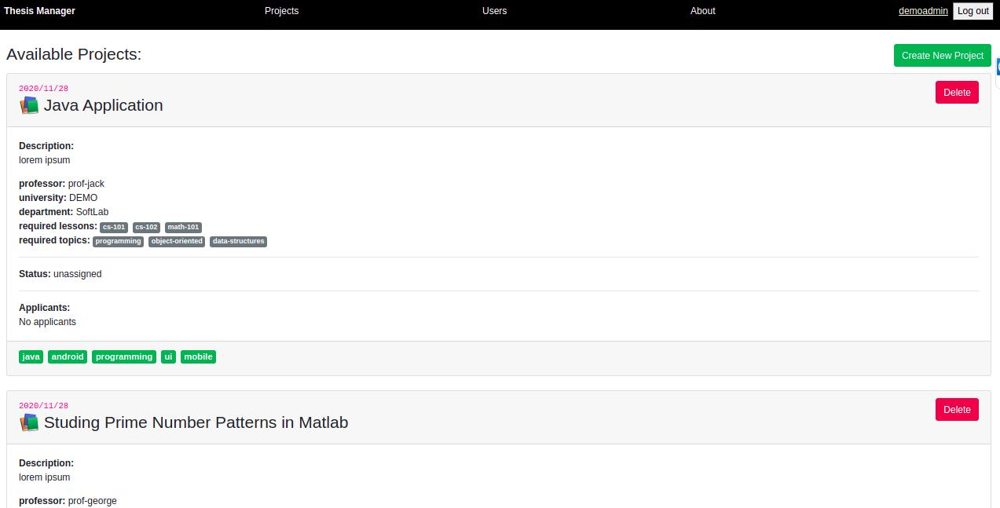

# thesis-manager 

This is a project consisting of a python backend and a react javascript front-end implementing a web application for managing thesis topic announcements and assignments on universities.

**Type of application**: web application

### Application components:

Component | Language   | Framework
----------|------------|----------
Backend   | Python     | Flask
Frontend  | Javascript | React
Datastore | Javascript interface and Binary JSON format | MongoDB 


## Some implementation details

Apps backend is written in python and uses the flask framework to create a rest-like API 
All data is stored in BSON format in the NoSQL database MongoDB
Front-end is created with react and uses bootstrap framework for css and ui styling. 

Application Roadmap
===================

Done:
- User Management
 - List Users
 - Create User
 - Update User
 - Delete User
- Project Management
 - List Projects
 - Create Project
 - Update Project
 - Delete Project
- Auth
 - Login (User/Roles)
- Other Tasks
 - Apply for project (As a user) - Done in backend
 - External sign-in with oidc 


TODO:
- Apply for Project (As a user) - TODO in frontend
- Accept user applications (As a teacher)

# Some Screenshots

## Login screen


## Users List


## Project List



# Deployment through docker

Make sure you have `docker` and `docker-compose` installed in your system

- clone locally and enter project folder
```
git clone https://github.com/btouls/thesis-manager
cd thesis-manager
```

- run docker-compose 
```
docker-compose up
```

# Manual Deployment

The application was developed and tested on the following system/stack:

- OS: `Ubuntu 18.04`
- Python version: `3.6.9`
- Node version: `v14.15.0`
- NPM version: `6.14.8`
- Mongo Version: `v4.4.1`

### 1) Installing mongodb 4.4 (ubuntu deb-like systems)

Add repo key
```
sudo apt-get install gnupg
wget -qO - https://www.mongodb.org/static/pgp/server-4.4.asc | sudo apt-key add -
```

Add Mongodb sources list in your ubuntu os:

For ubuntu 18.04 issue:
```
echo "deb [ arch=amd64,arm64 ] https://repo.mongodb.org/apt/ubuntu bionic/mongodb-org/4.4 multiverse" | sudo tee /etc/apt/sources.list.d/mongodb-org-4.4.list
```

For In latest ubuntu 20.04 issue:
```
echo "deb [ arch=amd64,arm64 ] https://repo.mongodb.org/apt/ubuntu focal/mongodb-org/4.4 multiverse" | sudo tee /etc/apt/sources.list.d/mongodb-org-4.4.list
```

Reload local package database:
```
sudo apt-get update
```

Install mongodb components:
```
sudo apt-get install -y mongodb-org
```

Start and verify that mongodb works:
```
sudo systemctl daemon-reload
sudo systemctl start mongod
sudo systemctl status mongod

```

### 2) Git Clone locally the project

Get the project locally by issuing
```
git clone https://github.com/btouls/thesis-manager
```

Enter ther project's root folder:
```
cd ./thesis-manager
```


### 3) Starting the backend

Go to the backend folder:
Assuming you are in the root folder `./thesis-manager` issue:
```
cd ./backend/
```

Install pip3 
```
sudo apt install python3-pip
```

Install backend depedencies (flask, pymongo and other stuff)
```
pip3 install -r requirements.txt
```

Important: Populate Database with sample and demo data (run init_db script)
```
mongo mongo_init.js
```

To start the backend in development mode issue:
```
flask run
```

The backend will start running by default in `localhost:5000`

### 4) Starting the frontend
Install nodejs v14.15.0 (or later) in ubuntu:
```
curl -fsSL https://deb.nodesource.com/setup_14.x | sudo -E bash -
sudo apt-get install -y nodejs
```

Check that nodejs and npm runs by quering their version
```
nodejs --version
npm --version
```

Go to the frontend folder:
Assuming you are in the root folder `./thesis-manager` issue:
```
cd ./frontend/thesis-manager/
```

Install nodejs package dependencies
```
npm install
```

Run the ui in browser in devel mode
```
npm run start
```

The ui will start running by default at `localhost:3000`

### 4) Use the generated demo users to test the application
The init data are for local testing purposes only and the application to run in localhost

- Login as Demo Administrator with username:`demoadmin` and password: `demoadmin`
- Login as Demo Professor with username:`demoprof` and password: `demoprof`
- Login as Demo Student with username:`demostudent` and password: `demostudent`

 
