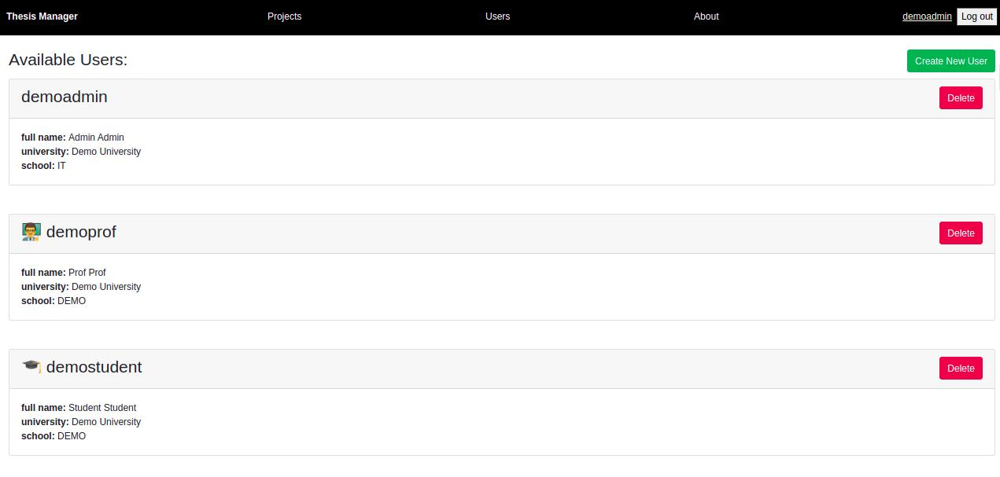

# thesis-manager 

This is a project consisting of a python backend and a react javascript front-end implementing a web application for managing thesis topic announcements and assignments on universities.

**Type of application**: web application

### Application components:

Component | Language   | Framework
----------|------------|----------
Backend   | Python     | Flask
Frontend  | Javascript | React
Datastore | Javascript interface and Binary JSON format | MongoDB 

## Some implementation details

Apps backend is written in python and uses the flask framework to create a rest-like API 
All data is stored in BSON format in the NoSQL database MongoDB
Front-end is created with react and uses bootstrap framework for css and ui styling. 

Application Roadmap
===================

Done:
- User Management
 - List Users
 - Create User
 - Update User
 - Delete User
- Project Management
 - List Projects
 - Create Project
 - Update Project
 - Delete Project
- Auth
 - Login (User/Roles)
- Other Tasks
 - Apply for project (As a user) - Done in backend
 - External sign-in with oidc 

TODO:
- Apply for Project (As a user) - TODO in frontend
- Accept user applications (As a teacher)

# Some Screenshots

## Login screen

## Users List

## Project List
